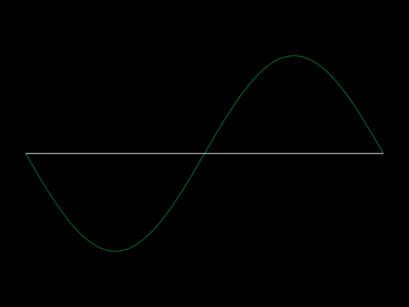

<div align="center">
 
</div>

# Audio Signal Processing in Python
The analysis of audio signals is a fundamental task in many fields, such as music, sound engineering, and data compression. This project proposes the implementation of the Fourier Transform to decompose audio signals into their frequency components. Tools such as the Discrete Fourier Transform (DFT) and the Fast Fourier Transform (FFT) will be used to achieve this purpose, taking advantage of their ability to analyze signals in the frequency domain. The implementation will be carried out in Python, using specialized libraries. The expected results include a clear representation of the frequency spectrum and a comparison of the efficiency between DFT and FFT, demonstrating how these tools improve real-time signal analysis and processing and other key applications.

<div align="center">
    
</div>

<hr>

###  Fourier Transform
$$ 
X(f) = \int_{-\infty}^{\infty} x(t) e^{-j 2 \pi f t} \, dt
$$

### (DFT) Discrete Fourier Transform
$$ X_k = \sum_{n=0}^{N-1} x_n \cdot e^{-j \frac{2\pi}{N} k n} $$

### (FFT) Fast Fourier Transform


<hr>

### Stack 


<hr>

## Library Installations

Installs several libraries such as librosa, soundfile, requests, beautifulsoup4, pandas, pytube, and youtube_dl for audio processing, web scraping, and data manipulation.

> [!IMPORTANT]
> ```Imports necessary libraries for audio processing (librosa, soundfile, numpy, matplotlib, youtube_dl, IPython.display, scipy.signal) ```


## Authores
  